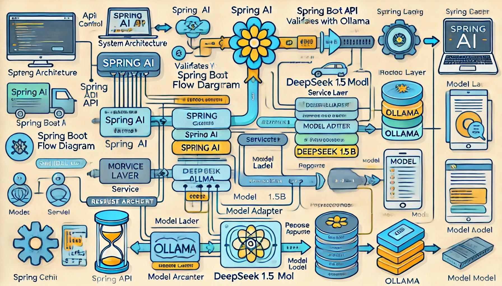

# 🚀 Low-Level Design (LLD) for Spring AI Application

## 📑 **Low-Level Design (LLD) for Spring AI API**

### **1. Modules and Components**

| **Module**               | **Description**                                                                 |
|---------------------------|---------------------------------------------------------------------------------|
| **API Controller**        | Manages HTTP requests and routes to appropriate services.                      |
| **Request Validation**    | Validates incoming user requests to ensure they meet API requirements.         |
| **Service Layer**         | Handles business logic and interacts with the AI engine through Spring AI.     |
| **Model Adapter**         | Responsible for integrating Ollama and managing LLM interactions.              |
| **LLM Integration**       | Facilitates requests to the DeepSeek 1.5B model and returns processed results. |
| **Response Handler**      | Formats and returns the API responses to clients.                              |
| **Error Handling Module** | Handles exceptions and provides meaningful error responses.                    |

---

## 🔍 **2. Sequence Flow**
1. **Client Request:**  
   The user sends an HTTP request to the Spring Boot API with a prompt in the payload.
2. **Request Validation:**  
   The API Controller validates the request structure and headers.
3. **Service Invocation:**  
   The Controller forwards the request to the Service Layer.
4. **LLM Integration:**  
   The Service Layer uses Spring AI to call the Ollama service hosting the DeepSeek 1.5B LLM.
5. **Model Processing:**  
   DeepSeek processes the prompt and returns a text-based response.
6. **Response Handling:**  
   The API formats the response and returns it to the client.
7. **Error Handling:**  
   Any errors encountered are logged and an appropriate error response is returned.

---

## 📖 **3. Class Diagram**
```plaintext
+--------------------+
|  API Controller    |
+--------------------+
        |
        V
+--------------------+
| Request Validator  |
+--------------------+
        |
        V
+--------------------+
|   Service Layer    |
+--------------------+
        |
        V
+--------------------+
| LLM Model Adapter  |
+--------------------+
        |
        V
+--------------------+
| DeepSeek API Client|
+--------------------+
```

---

## **4. Database (Optional)**
If required, future improvements can involve logging requests and responses in a database.

---

## **5. Image Depicting the Flow**



---
